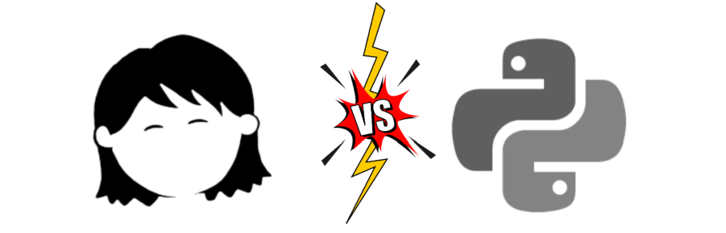
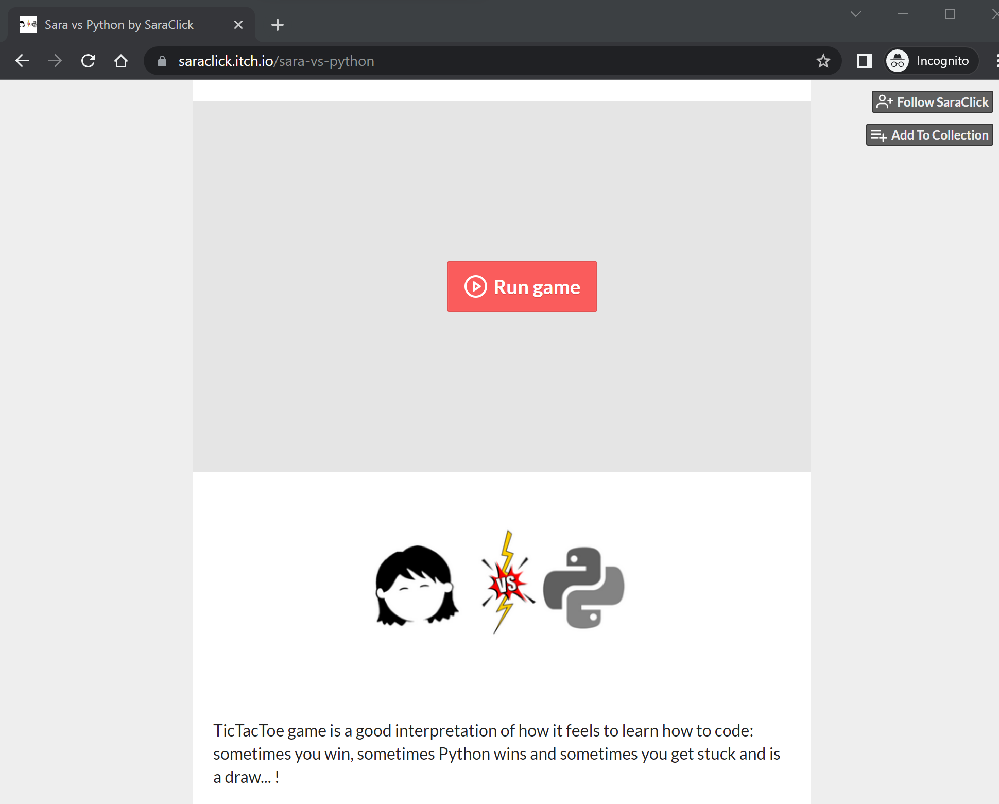
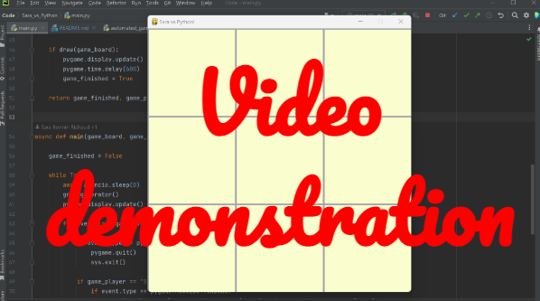

---
### 👀 READ ME

**Sara vs Python** is a tic-tac-toe game representing how I sometimes feel when coding as sometimes:
- I win: yay! I know how to implement something :)
- Python wins: oh oh... errors ! Python teaches me the way forward!
- It's a draw: roadblock found, no one wins.... learning time!

---

#### 💻 TECH USED

- Python 3.10 including asyncio (pygbag), pygame, sys, random and unittest
- PyCharm
- itch.io for the browser publication

---

#### 👾 MAIN FEATURES
- First move when opening the game is always assigned to "Sara", the user.
- The user is playing against "Python".
- Python is an automated player, the user only has to move for "Sara".
- Python moves have a delay of 600 milliseconds, but 0 delay if it's the first move in a reset board.
- When Sara/Python win, the winning line is replaced by colored icons (see how cute do the stars look in my hair...? awww)
- When is a draw, no one wins.
- If we reach one of the players winning or a draw, the game resets to a clean board. 
- When reset, the player to make the first move will be the opposite who made the last move.
- The user can close the window to finish playing at any time.

---

#### 🎮 PLAY THE GAME 
The game has been published on itch.io so users can try it on. 

**How to play?**

1. Click the following link: 
[https://saraclick.itch.io/sara-vs-python](https://saraclick.itch.io/sara-vs-python)
2. Click "Run Game" and the game will start! you move first, so choose wisely...😁  

---
#### 🎥WATCH DEMO

---

#### 📆DATE OF COMPLETION:
- December 2022
